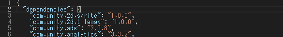
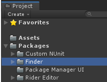
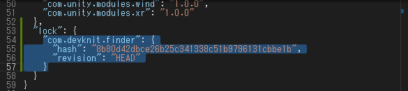

# Finder

Unity が管理しているアセットを見つける補助ツールのパッケージです。

---

### インストール方法

Windows の場合はコマンドプロンプト、Mac、Linux の場合はターミナルで  
`git` のコマンドが実行可能な状態か確認してから行って下さい。

パッケージをインストールしたい Unity プロジェクトの  
Packages/manifest.json をテキストエディタで開きます。

開いたら "dependencies" ノード内に以下を追加してください。

```
"com.devknit.finder": "https://github.com/devknit/FinderPackage.git",
```



追加した状態を保存後、Unity にフォーカスを当てると
パッケージのインストールが行われます。

インストールが正しく行わると `Projectウィンドウ` の `Packages` に  
`Finder` が追加されていることが確認できます。



---

### 起動方法

Unity のメニューに Tools > Finder > Open から起動できます。
ショートカットキーの　ALT + F でも起動することが可能です。

---

### アップデート方法

パッケージがインストールされている Unity プロジェクトの
Packages/manifest.json をテキストエディタで開きます。

開いたら "lock" ノード内にある "com.devknit.finder" を削除してください。



削除した状態を保存後、Unity にフォーカスを当てると
パッケージのアップデートが行われます。
