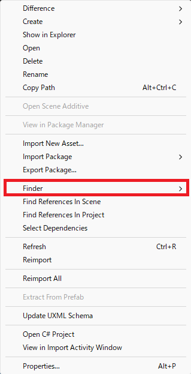

# Finder

Unity が管理しているアセットの依存関係を可視化する補助ツールのパッケージです。

## インストール方法

Unity のドキュメント [Git URL からパッケージをインストールする](https://docs.unity3d.com/ja/current/Manual/upm-ui-giturl.html) の手順に従って以下のURLを指定してください

```
https://github.com/devknit/FinderPackage.git
```

## アップデート方法

Unity のドキュメント [別のパッケージバージョンへの変更](https://docs.unity3d.com/ja/current/Manual/upm-ui-update.html) に従ってください

## 使用方法

Unity の Project ウィンドウで任意のアセットを選択した状態から、右クリックでコンテキストメニューを開きます



メニュー項目の中から `Finder` を選択、またはマウスオーバーをすると以下の項目が現れます

- Select To Dependencies：Project ウィンドウで選択されているアセットが依存しているアセットを表示します
- Select From Dependencies：Project ウィンドウで選択されているアセットに依存しているアセットを表示します


項目を選択すると上記のようなウィンドウが表示されます。

## ① 依存関係と更新

Select で選択されているアセットに対して Dependent に表示されるアセットの依存関係の方向を示しています

ボタンになっているため、クリックすることで結果を更新することが可能です

右側にある ▼ はドロップダウンメニューを表示し、依存関係を選択しなおすことが出来ます

### To Dependencies

Select で対象にしているアセットが依存している（子供の関係にある）アセットを表示します

Recursive にチェック入っている場合は依存しているアセットがさらに依存している（孫、曾孫..）アセットまで検出するようになります

### From Dependencies

Select で対象にしているアセットに依存している（親の関係にある）アセットを表示します

Recursive にチェック入っている場合は依存していたアセットがさらに依存していた（祖、曽祖）アセットまで検出するようになります

## ② 依存関係の再帰性

Recursive のチェックボックスを入れると対象を再帰的に検索するようになります

動作は依存関係によって変化するため [To Dependencies](#to-dependencies)、[From Dependencies](#from-dependencies) を参照してください

## ③ 選択された対象

依存関係を調査する対象に選択されているアセットが表示されます

検出された数は Reference の列に表示されます

基本的にツリーに表示されるのはアセットとなりますが、アセットの中に Missing となる要素があった場合は、子要素に設定不備がある場所が追加されます

設定不備は左端に警告アイコンが表示され、黄色の文字列でパスと型が表示されます

また、不備が見つかった個数は Missing 列に表示されます

## ④ 依存関係にあるアセット

選択された対象と依存関係にあるアセットが表示されます。

表示のフォーマットは [選択された対象](#-選択された対象) と同様です

## ⑤ アセットが選択されたときの挙動

アセットが選択された時の挙動をドロップダウン形式で選択することが出来ます

選択可能な項目は以下になります

- None：何もしません
- Ping：対象のアセットが強調されます
- Ping - file only：対象のファイルのみ強調表示されます
- Active：対象のアセットが Project ウィンドウで選択されます
- Active - file only：対象のファイルのみ Project ウィンドウで選択されます

## ⑥ ウィンドウタブ

各種タブの表示非表示を切り替えられます
